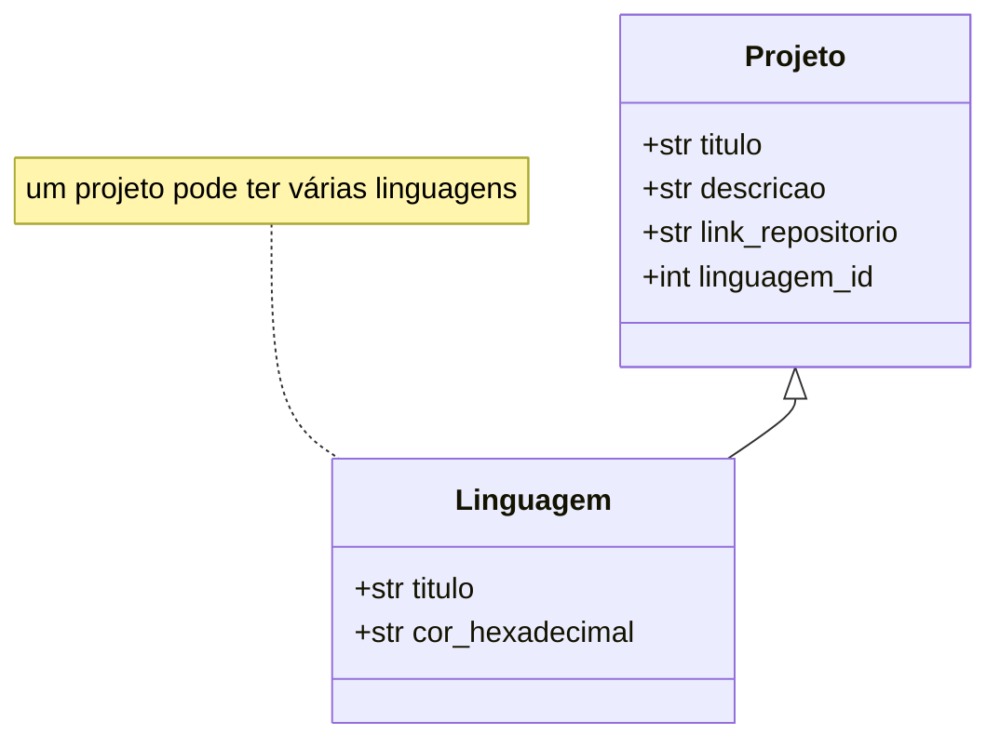

# Portifolio

## Escopo do Projeto

Desenvolvimento de portifolio usando o framework Django para exibição de meus projetos.

## Tecnologias Utilizadas

(em desenvolvimento)

## Como Usar

(em desenvolvimento)

## Principais Funcionalidades

- CRUD de projetos;
- Manutenção do portifolio via django admin

## Requisitos

(em desenvolvimento)

## Modelagem de dados

## Links Úteis

(em desenvolvimento)
