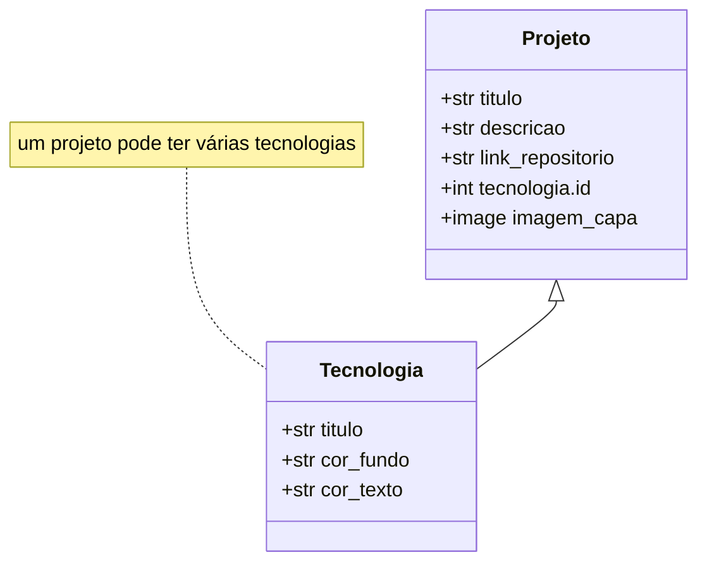

# Portifolio


## Escopo do Projeto

Desenvolvimento de portifolio usando o framework Django para exibição de meus projetos.

## Tecnologias e Dependências

- Python 3.3+
- Django 5.2.8
- Pillow 12.0.0
- pip (gerenciador de pacotes Python)
- git

## Como Usar

### 1. Clone o repositório

```bash
git clone https://github.com/igorpaula7/portifolio.git

cd portifolio
```

### 2. Crie um ambiente virtual

```bash
# Windows
python -m venv venv
venv\Scripts\activate

# macOS/Linux
python3 -m venv venv
source venv/bin/activate
```

### 3. Instale as dependências

```bash
pip install -r requirements.txt
```

### 4. Configure o banco de dados

```bash
python manage.py makemigrations

python manage.py migrate
```

### 5. Crie um superusuário

```bash
python manage.py createsuperuser
```

### 6. Execute o servidor

```bash
python manage.py runserver
```

O projeto estará disponível em: `localhost:8000/`

Acesse a url `localhost:8000/admin` para adicionar os projetos do portifolio.

## Principais Funcionalidades

- CRUD de projetos;
- Manutenção do portifolio via django admin;
- Adição de tecnologias com fundo e texto personalizados;

## Modelagem de dados



## Links Úteis

(em desenvolvimento)
