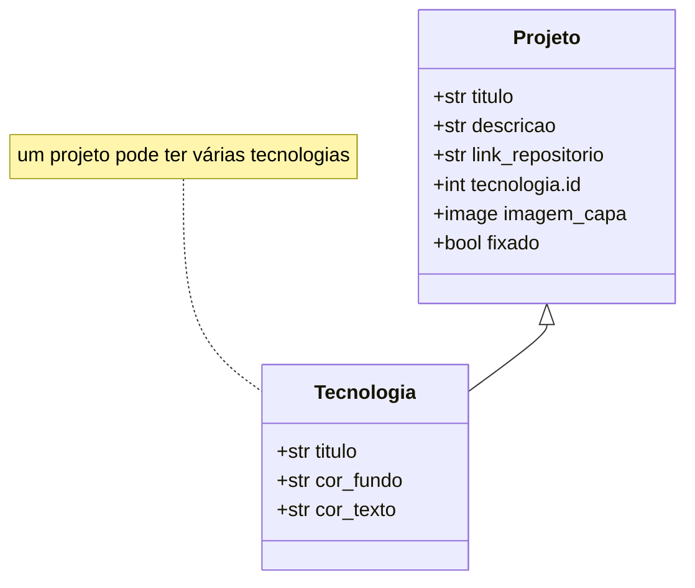

# Portifolio


## Escopo do Projeto

Desenvolvimento de portifolio usando o framework Django para exibição de meus projetos.

## Tecnologias e Bibliotecas

### Tecnologias

- Python 3.3+
- Versionamento Git
- Gerenciador de pacotes Pip

### Bibliotecas

- Django 5.2.8
- Pillow 12.0.0
- Python decouple 3.8

## Como Usar

### 1. Clone o repositório

```bash
git clone https://github.com/igorpaula7/portifolio.git

cd portifolio
```

### 2. Crie um ambiente virtual

```bash
# Windows
python -m venv venv
venv\Scripts\activate

# macOS/Linux
python3 -m venv venv
source venv/bin/activate
```

### 3. Instale as dependências

```bash
pip install -r requirements.txt
```

### 4. Configure o arquivo .env

```bash
cd core

cp .env.example .env
```

Edite o arquivo .env, caso esteja em ambiente de desenvolvimento mantenha as seguintes linhas:

```
SECRET_KEY= cole-sua-secret-key-aqui
DEBUG=True
ALLOWED_HOSTS=localhost,127.0.0.1
ENVIRONMENT=development
```

Caso esteja em produção, use as seguintes linhas:

```
SECRET_KEY=cole-sua-secret-key-aqui
DEBUG=False
ENVIRONMENT=production
DB_NAME=
DB_USER=
DB_PASSWORD=
DB_HOST=
```

Lembre-se sempre de alterar a SECRET_KEY. Ela pode ser gerada através dos seguintes comandos:

```bash
python manage.py shell

# Execute dentro do shell:

from django.core.management.utils import get_random_secret_key
print(get_random_secret_key())
```

### 5. Configure o banco de dados

```bash
python manage.py makemigrations

python manage.py migrate
```

### 6. Crie um superusuário

```bash
python manage.py createsuperuser
```

### 7. Execute o servidor

```bash
python manage.py runserver
```

O projeto estará disponível em: `localhost:8000/`

Acesse a url `localhost:8000/admin` para adicionar os projetos do portifolio.

## Principais Funcionalidades

- CRUD de projetos;
- Manutenção do portifolio via django admin;
- Botão para acesso ao curriculum vitae;
- Adição de tecnologias com fundo e texto personalizados;
- Configuração de projetos fixados;
- Seção de contato incluindo links para: GitHub, E-mail, LinkedIn e Substack.

## Modelagem de dados



## Links Úteis

**Deploy do Projeto no PythonAnywhere**: [Clique Aqui](https://igorpaula7.pythonanywhere.com)  
**Documentação do Django**: [Clique Aqui](https://docs.djangoproject.com/pt-br/6.0)  
**Página do Projeto no Notion**: [Clique Aqui](https://igorpaula7.notion.site/Portif-lio-Django-2cea1c1c46f98009916bc876c540e7a9?source=copy_link)

## Contato

[](mailto:igoroliveira7896@gmail.com)
[](https://www.linkedin.com/in/igorpaula7/)
[](https://substack.com/@igoroliveiradepaula?)
